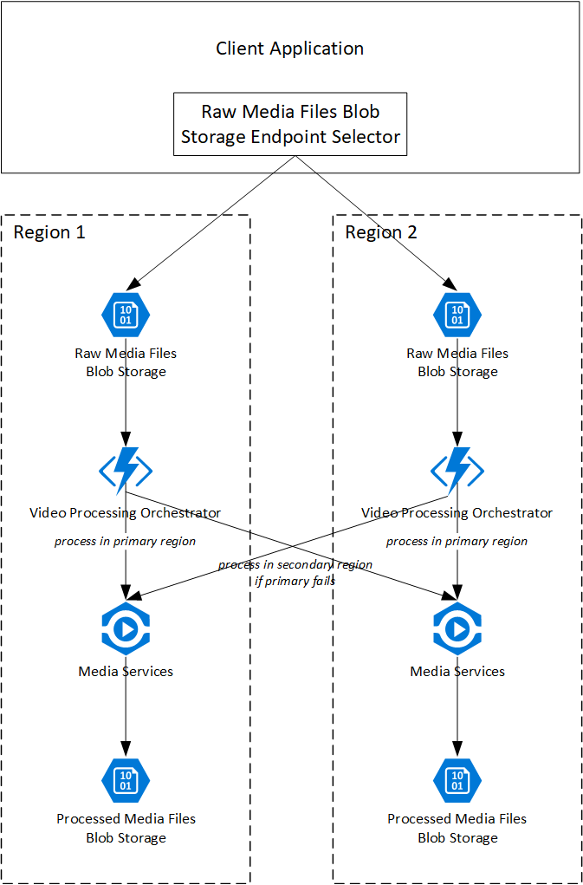

# High availability for Azure Media Services encoding

Azure Media Services (AMS) runs within a single region. In the event of a regional outage or fault, requests to the encoding service within that region may fail. Solutions that require a high degree of fault tolerance may benefit from deploying their infrastructure across multiple regions. Azure Media Services does not provide monitoring of service faults, so the status of a given region's service must be inferred from the observed behaviour when submitting requests to the service.

This is an implementation of a variant of the [Scheduler Agent Supervisor pattern](https://docs.microsoft.com/en-us/azure/architecture/patterns/scheduler-agent-supervisor).

## Solution design

This solution involves three layers, each with varying levels and types of redundancy:

1. The *client layer* is in the client application, which uploads blobs to a CDN or storage account and then communicates with the orchestration layer to begin processing the media file. In the event of a failure when uploading the file or communicating with the orchestration layer, the client must retry the request or fail over to an orchestration layer in an alternate region.

2. The *orchestration layer* is responsible for accepting a media file to process, and then initiating a long-running process to request the encoding of the media file at the encoding layer. The orchestration layer supervises the encoding process, and if it determines that an encoding job has failed due to a regional issue, it will retry in an alternative region. Once an encoding job has been successfully completed, the orchestration layer can notify the client and provide a URL to the encoded file.

3. The *encoding layer* is comprised of a set of Azure Media Services instances, as well as a storage account and CDN endpoint associated with each AMS instance.

The following diagram illustrates these components:

## Overall request flow

1. The *client* is responsible for uploading raw media blobs to a regional Azure CDN endpoint backed by a regional ingestion blob storage container. The client must select a regional CDN endpoint to use, and may have multiple strategies for doing so such as round-robin (i.e. evenly distribute requests to all available regions) or regional affinity (i.e. send all requests to a designated region, unless that region is unavailable). The CDN will handle writing the blob to a storage account. The client should not proceed with the subsequent step until the CDN has completed the write request. The client should use a combination of the [Retry](https://docs.microsoft.com/en-us/azure/architecture/patterns/retry) and [Circuit Breaker patterns](https://docs.microsoft.com/en-us/azure/architecture/patterns/circuit-breaker) to handle both transient failures and regional outages.

2. Once blobs have been written to the CDN, the client will notify the orchestration layer that the job is ready for processing. This is achieved by making a synchronous (HTTP) request to the *Initiator* function, including the HTTP URL of the media file to process. Importantly, the CDN URL of the file should be provided and not the blob storage URL; this is to both enhance performance and guard against regional blob storage failures. In the event that the preferred region's *Initiator* function is not responsive, the client can retry against an alternative region without re-uploading the file.

3. The *Initiator* function initiates a durable function orchestration within the *Orchestrator* function app. The durable function orchestration manages a series of attempts to encode the media using Azure Media Services. The first attempt will use the Azure Media Services instance within the same region as the function app. If the attempt fails due to an error or times out, the *Orchestrator* function then selects an alternative AMS instance in another region to submit the request to.

4. Job progress status updates from AMS will be captured in two ways. First, the [Azure Media Services Event Grid topic](https://docs.microsoft.com/en-us/azure/media-services/latest/reacting-to-media-services-events) will publish status updates; these cannot be sent directly into the *Orchestrator* function due to the way that Event Grid handles suscription validation, so a *Job Status Proxy* function acts as a sink for the Event Grid events and sends them to the *Orchestrator* function by making use of [Durable Functions' support for external events](https://docs.microsoft.com/en-us/azure/azure-functions/durable/durable-functions-external-events). Second, the *Orchestrator* function also will occasionally directly poll the AMS API for job progress updates if it has not received an event within a given time threshold.

5. Once the job is completed, AMS will write the output file to a blob storage container, which in turn is fronted by an Azure CDN endpoint. Each region has its own set of AMS instances with paired blob storage accounts and CDN endpoints. The *Orchestrator* will become aware of the completion of the job using the same status update pathway described above, and will receive the final output blob URL from AMS. To enhance redundancy, the *Orchestrator* will map the URL of the encoded media blob to use the CDN endpoint URL rather than a blob storage account URL. The *Orchestrator* can then perform any necessary actions to notify the client of the completion of the job.

## Orchestrator function logic

The *Orchestrator* function is responsible for ensuring that the media encoding job is processed, including acting as a supervisor of the job and performing corrective action if availability issues are observed. It also can perform other functions if needed, including scaling the AMS instances and reporting job status to the client.

[Sub-orchestrations](https://docs.microsoft.com/en-us/azure/azure-functions/durable/durable-functions-sub-orchestrations) are used in order to encapsulate the region-specific AMS processing logic.

The core logic for the orchestrator function is:

* Perform any initial steps, such as scaling AMS if needed.
* Calculate the expected time for the job. This must be calculated in order to detect abnormally long processing times, which might indicate a problem with the AMS instance processing the job. For simplicity this solution uses a fixed value of 20 minutes. However, a better approach would be to use historical data to calculate this based on the length of the raw file, such as the 99th percentile of the processing time for a media file of the specified length and format.
* Initiate the sub-orchestration (described below) against the primary region.
  * If that sub-orchestration fails, initiate the sub-orchestration against the secondary region.
* If at least one of the sub-orchestrations have completed successfully, map the AMS encoded output URL from a blob storage URL to a CDN URL.
* Peform any post-job cleanup, such as scaling down AMS.
* Notify any interested clients of the final status of the job.

### Sub-orchestration: Submit and Monitor Job

* Submit job to specified AMS instance and retrieve job ID.
* Loop until the timeout has elapsed:
  * Wait for an external status update event from the *Job Status Proxy*. Set a timeout of 10 minutes.
  * If no update has been received within the 10 minute timeout, synchronously request the job status from the AMS API.
  * If the job status is `Error`, terminate the sub-orchestration and report the status as `failed` to the parent orchestration.
  * If the job status is `Processing`, compare the actual elapsed time against the expected time calculated by the parent orchestration. If the expected time has been exceeded, assume AMS is no longer responsive. Terminate the sub-orchestration and report the status as `failed` to the parent orchestration.
  * If the job status is `Finished`, obtain the output blob URL. Terminate the sub-orchestration and report the URL and `succeeded` status to the parent orchestration.

[For more details on the use of Durable Functions to implement the Monitor pattern, see the documentation.](https://docs.microsoft.com/en-us/azure/azure-functions/durable/durable-functions-overview#monitoring)

## Fault tolerance

The following types of outages are mitigated by this approach:

1. **Blob storage regional outages and faults.** In the event of a regional issue with Azure Storage that prevents the client from uploading blobs, the client application will route the writing of blobs to the secondary region.
2. **Blob storage partial failures.** In the event of a blob storage failure after the client has successfully uploaded the blob but before it has processed it, the CDN may have cached a copy of the file. Therefore, there is some resiliency to failures in the blob storage service.
3. **Azure Media Services regional outages and faults.** In the event of a regional issue with Azure Media Services, the orchestration layer will eventually determine that the service is unhealthy and will route requests to an AMS instance in the secondary region.
4. **Event Grid regional outages and faults.** In the event of an issue preventing Event Grid sending AMS status updates to the components within the *Ingestion/Orchestration Layer*, the polling operations within the durable function orchestrator will nevertheless request job progress status updates from AMS and will take action on these as needed.

Furthermore, this approach allows for geo-distribution of the workloads. If the client application is aware of the locations of the regions, it can direct user traffic in the first instance to the closest or best-performing region.

## Advantages and disadvantages

This approach has the following advantages:

1. **Horizontal scalability.** While this sample implements a solution with only two regions, it could easily be extended to use additional regions. In an extreme case, a single media encoding job could potentially be sent to instances of Azure Media Services within all supported Azure regions. By expressing all infrastructure as code, it is trivial to instantiate a new region, and minimal code changes would be required to add the new region into the pool of available regions for processing requests.

2. **Cacheability of endpoint status.** The client application can optionally maintain a cache of the current state of each raw media file blob storage instance and use this to direct subsequent requests to the best available endpoint, rather than attempting a request against an endpoint that is likely to be unsuccessful. Similarly, the video processing orchestrator function instances could optionally maintain a cache of the current state of each Azure Media Services instance.

However, the approach has a number of disadvantages and caveats:

1. **Delayed processing.** In the event of a problem with Azure Media Services that results in timeouts, it may take some time before the orchestrator recognises this and attempts to reprocess the media file in a secondary region. If processing time and availability are critical for your solution, consider lowering the timeout threshold or even sending the job to multiple regions in the first instance rather than waiting for a problem. This will result in additional processing costs.

2. **Additional costs.** A highly available solution of this nature will result in additional costs. These can be broken into three categotries:
   * *Infrastructure:* Geo-replication of this nature requires application components to be deployed to multiple regions. This will increase the run cost of the solution.
   * *Media processing:* The nature of this solution is that media may be processed multiple times. The frequency of this happening will depend in part on the fault tolerance logic and the determination of whether the primary region is available.
   * *Data egress:* If media files are stored within one region and processed in another, they may be subject to [Azure egress traffic pricing](https://azure.microsoft.com/en-us/pricing/details/bandwidth/). However, [by using Azure CDN, this cost is minimised](https://azure.microsoft.com/en-us/pricing/details/cdn/).

3. **Limited scope.** This solution is not designed to provide high availability across every component of the solution. Single points of failure still exist, including the function app and the [Azure Storage components used by the Durable Functions SDK](https://docs.microsoft.com/en-us/azure/azure-functions/durable/durable-functions-perf-and-scale). In the event that a request is accepted into a region's *Ingestion/Orchestration layer* and then a regional outage occurs in these components, jobs may not be completed until the outage is resolved. Alternative approaches would be necessary to mitigate this risk.

4. **Region awareness.** Each layer in this solution needs to be aware of the regions used to deploy the next layer down: the client layer needs to be aware of the CDN endpoints for all regions in which the ingestion/orchestration layer is deployed, and the orchestrator function needs to be aware of the AMS endpoints and associated blob storage accounts for all regions in which the encoding layer is deployed.
