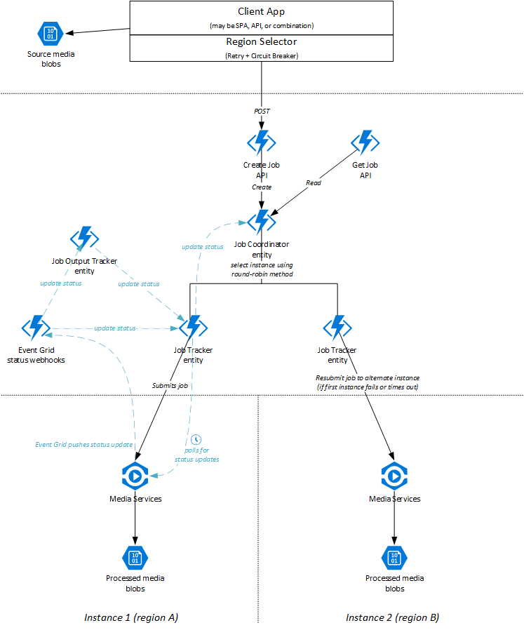

# High availability for Azure Media Services encoding

Azure Media Services (AMS) runs within a single region. In the event of a regional outage or fault, requests to the encoding service within that region may fail. Solutions that require a high degree of fault tolerance may benefit from deploying Media Services instances across multiple regions. This document describes a reference architecture for such a system, which is a variant of the [Scheduler Agent Supervisor pattern](https://docs.microsoft.com/en-us/azure/architecture/patterns/scheduler-agent-supervisor).

## Solution design

This solution involves three layers:

1. The *client application* performs the capture of the media files, and then communicates with the job coordination layer to begin processing the media file. In the event of a failure when uploading the file or communicating with the orchestration layer, the client must retry the request or fail over to another instance of the job coordinator in an alternate region.

2. The *job coordinator* is responsible for accepting a media file to process, and then initiating the encoding of the media file at the encoding layer. The job coordinator supervises the encoding process. If it determines that an encoding job has failed due to a regional issue, it will retry the encoding in an alternative region. Once an encoding job has been successfully completed, the orchestration layer can notify the client and provide details to allow the client to access the encoded file.

3. The *encoding components* are comprised of a set of Azure Media Services instances, as well as a storage account associated with each AMS instance to hold the output assets.

The following diagram illustrates these components:

An implementation of this reference architecture is available in this repository. This implementation makes use of a feature of Azure Functions called durable entities. Entities are used to represent the encoding jobs, as well as the attempts to perform the encoding against a specific Media Services instance.

## Request flow

The client submits all encoding requests to the job coordinator. This is achieved by making a synchronous (HTTP) request to an API provided, including the HTTP URL of the media file to process. The API creates an instance of a *job coordinator entity* to coordinate the processing of the job. In the event that this API is not responsive, the client should retry against a job coordinator instance in alternative region.

The job coordinator is responsible for determining which Media Services instance to submit the job to initially. It might use a variety of strategies for this, such as:

  * Round-robin (i.e. evenly distribute requests to all available regions);
  * Regional affinity (i.e. send all requests to a designated region first).

Typically we recommend round-robin to ensure that requests are evenly distributed across instances.

Once the job coordinator has selected an instance of Azure Media Services to submit the job to, it initiates a *job tracker entity*. The job tracker is responsible for actually submitting the job to that instance using the Azure Media Services SDK. The job tracker then tracks the ongoing updates from that job. It does this by subscribing to the [Azure Media Services events through Event Grid](https://docs.microsoft.com/en-us/azure/media-services/latest/reacting-to-media-services-events); these are sent to a function that acts as a sink and then forwards the event details to the job tracker. Some updates are specific to an individual output of a job, and these are tracked through a separate *job output tracker entity*. The job output tracker will signal the job tracker when it detects progress has been made on one of its outputs.

If the job tracker does not receive any updates within a defined timeout period, or if the job fails due to a transient or regional issue, the job tracker will signal the job coordinator that its attempt has failed. The job coordinator then selects an alternative instance of Azure Media Services to make another attempt.

The client can poll the status of the job thorugh the job coordinator, and once an attempt has been successful the job's output asset details can be provided back to the client. However, if all instances of Azure Media Services fail to process the job, or if an error is returned indicating that there is a problem with the media file itself, then the job coordinator considers the job to have permanently failed.

## Advantages and disadvantages

This approach has the following advantages:

1. **Horizontal scalability.** This implementation can be extended to use any number of Azure Media Services instances that might be available. The job coordinator will make use of the entire set of available instances. It is trivial to instantiate a new region, and no code changes are required to add a new instance into the pool of available instances for processing requests.

2. **Explicit control of desired reliability.** By configuring the logic used by the job coordinator, it is possible to set tradeoffs between the cost, availability, and processing time of executing media encoding jobs. The implementation provided will execute serially, with the job provided to a single Azure Media Services instance at a time. This minimizes the cost by avoiding running an encoding job multiple times unnecessarily. However if a high-priority job requires processing as reliably and quickly as possible, it could potentially be sent to all instances of Azure Media Services simultaneously.

However, the approach has a number of disadvantages and caveats:

1. **Delayed processing.** In the event of a problem with Azure Media Services that results in timeouts, it may take some time before the job coordinator recognises this and attempts to reprocess the media file in a secondary region. If processing time and availability are critical for your solution, consider lowering the timeout threshold or even sending the job to multiple regions in the first instance rather than waiting for a problem. This will result in additional processing costs.

2. **Limited scope.** This solution is not designed to provide high availability across every component of the solution. Single points of failure still exist, including the function app and the [Azure Storage components used by the Durable Functions SDK](https://docs.microsoft.com/en-us/azure/azure-functions/durable/durable-functions-perf-and-scale). If a request is accepted into the job coordinator and then a regional outage occurs in one of these components, that job may not be completed until the outage is resolved. Alternative approaches would be necessary to mitigate this risk.

3. **Cost implications.** There may be some cost implications to executing jobs across regions, both because of the network traffic costs incurred when sending the media files as well as potentially redundant extra processing of a single job.
